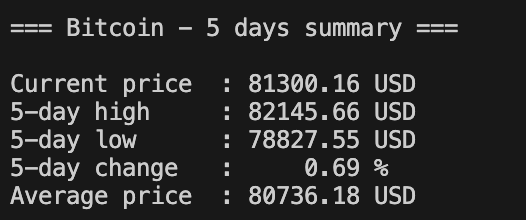

# Crypto Tracker

A command-line Python tool that fetches cryptocurrency market data from the CoinGecko API and displays a summary of price activity over a selected number of days.

## Features

- Fetch real-time cryptocurrency market data from the CoinGecko API
- Display:
  - Current price
  - Highest price
  - Lowest price
  - Average price
  - Price variation
- Filter results with command-line arguments
- Handle common errors:
  - Invalid coin name
  - Invalid number of days
  - Network/API errors

## Requirements

- Python 3.8+
- requests

## Installation

Clone the repository and install dependencies:
```bash
pip install requests
```

## Usage

### Basic command

```bash
python tracker.py --coin bitcoin --days 7
```

## Error handling 

The script handles several common errors:
- Network/API failure
- Invalid coin
- Invalid days value

Example:

```text
Error : 0 is not valid. --days must be greater than 0.
```

## Preview



## Example Output

```text
=== Bitcoin - 5 days summary ===

Current price  : 81300.16 USD
5-day high     : 82145.66 USD
5-day low      : 78827.55 USD
5-day change   :     0.69 %
Average price  : 80736.18 USD
```

## Notes

Coin names must use the official CoinGecko coin ID format.

Examples:
- bitcoin
- ethereum
- solana
- dogecoin

Incorrect examples:
- Bitcoin
- BTC
- Eth

You can find valid coin IDs on CoinGecko.
